# RGBNDR

RGBNDR is a video synthesiser made by circuit bending a VGA test generator. Inspired by [CHA/V by Jonas Bers](https://jonasbers.com/chav/).

RGBNDR is currently a set of two PCB:s. A board for circuit bending a VGA signal and a board for generating nice signals for bending video. It's a modular design so new boards can be easily added later.

Here's some instructions about how to build one. Schematics, eagle files and gerbers for manufacturing can be found form [https://github.com/ohss/RGBNDR](https://github.com/ohss/RGBNDR)

You can find some examples about what you can do with one on Instagram: [https://www.instagram.com/explore/tags/rgbndr/](https://www.instagram.com/explore/tags/rgbndr/) or you can check out the video below:

# Build it!

You will need to build two boards: RGBNDR board and Modulator board:

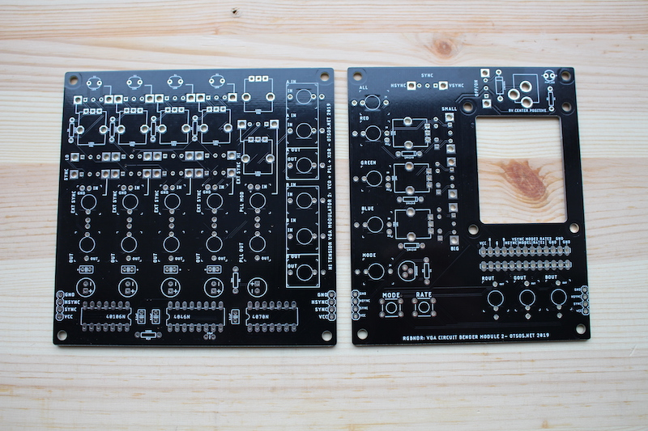

Here's a RGBNDR board hooked up to two modulator boards:

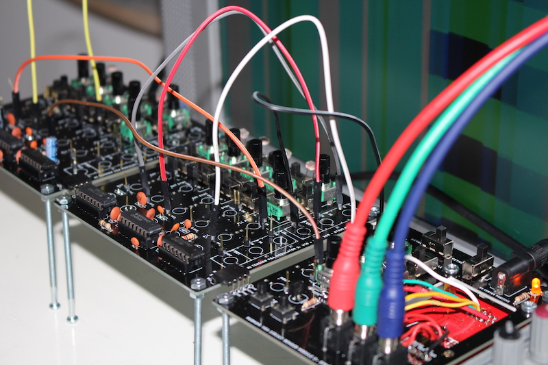

Here's a quick tip on how to solder:

[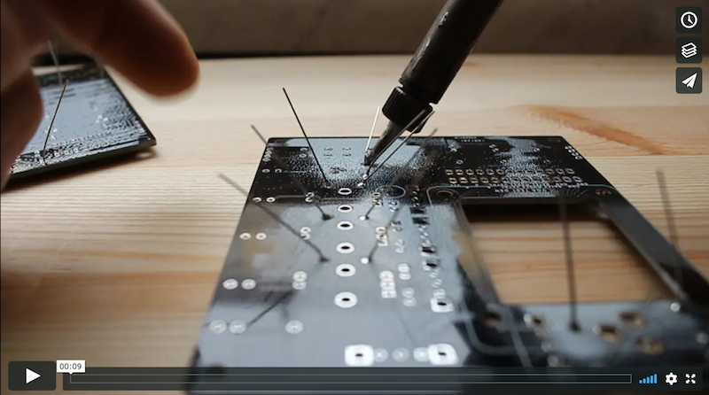](https://vimeo.com/324415428)

## Building RGBNDR (board with VGA test generator)

Here's what you'll need:

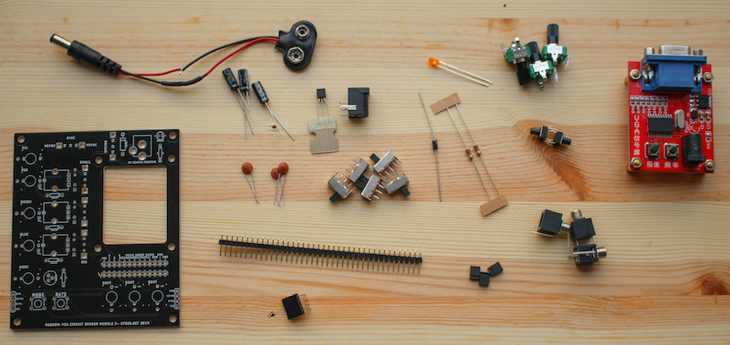

| Num | Part | Val | Comment | Link |
|-----|------|-----|---------|------|
|2x1|Male pin header||||			
|3x2|Male pin header||||			
|1x4|Female pin header|90° angle|||
|1|Led|3mm|||
|2|Pushbutton|MOMENTARY-SWITCH-SPST-PTH-6.0MM|||
|5|Slide switch|SLIDE SWITCH 1P2T THROUGH HOLE 0.5A 50VDC||https://www.taydaelectronics.com/slide-switch-1p2t-through-hole-0-5a-50vdc-2713.html|
|3|Ceramic capacitor|0.1uF (104)|Try out different values||
|3|Electrolytic capacitor|10uF|Try out different values. Remember polarity!||
|3|Potentiometer|10k|||
|1|Diode|1N4004|||
|3|Jumper wire||PCB has places for 1N4148 diodes. Use jumpers instead.||
|2|Resistor|1k|||
|1|Transistor|2N2222|Check polarity||
|1|Power Jack||V2 revision has a mistace on power. It's cCenter negative NOT center positive ||	
|3|Mono 3.5mm jack|Thonkiconn|Optional|https://www.thonk.co.uk/shop/3-5mm-jacks/|		

Start with adding caps to the bottom side. Remember to check polarity on electrolytic caps!

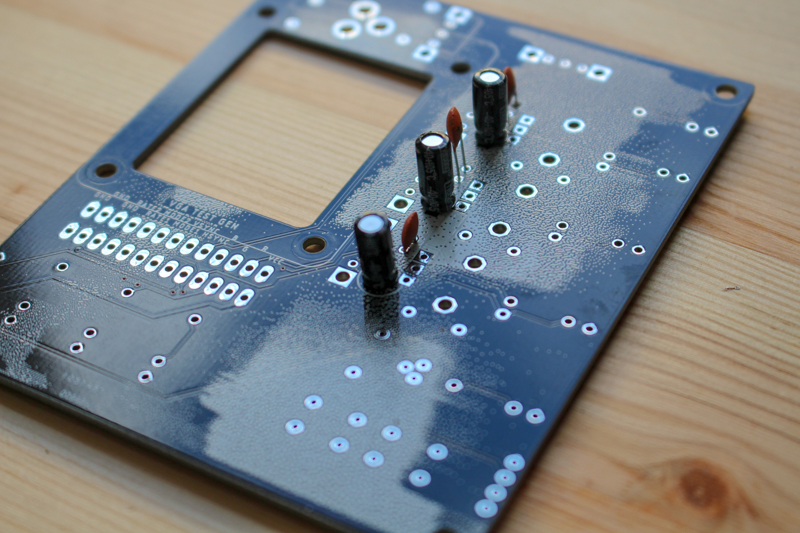

Use cap legs that you just cut out as jumpers. You'll need three. On the board there is three spots for 1N4148 diode. Use the jumpers instead.

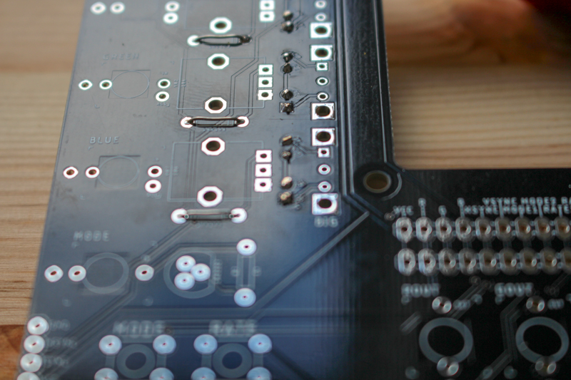

Add two 1k resistors and 1N4004 diode. Remember to check diode polarity!

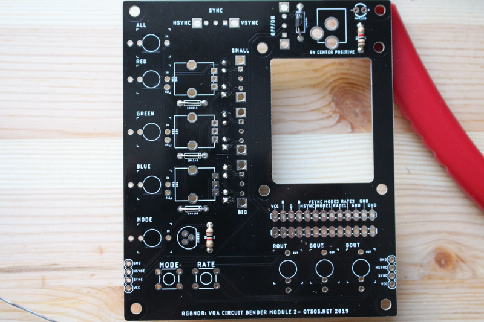

Next one is a bit tricky. You'll need to solder header pins to the board. I like to place the header pins on the board, put a piece on cardboard on top of the pins and then flip the whole thing over with the cardboard keeping the pins where they should be. Usually they fall all over the place.

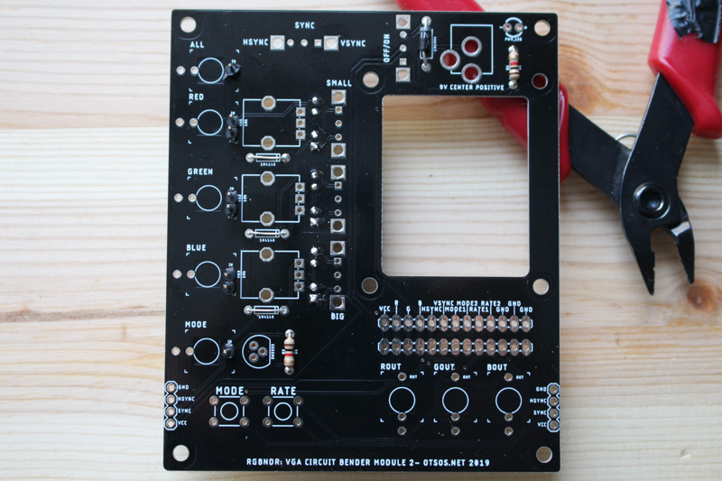

Then: pushbuttons, transistor (match the flat side to the flat line on the board ) and led. Long leg goes to +.

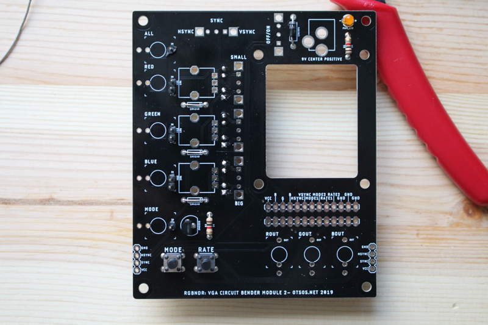

Add female angle header for connecting with other board. Use a helping hand to get the angle header high enough:

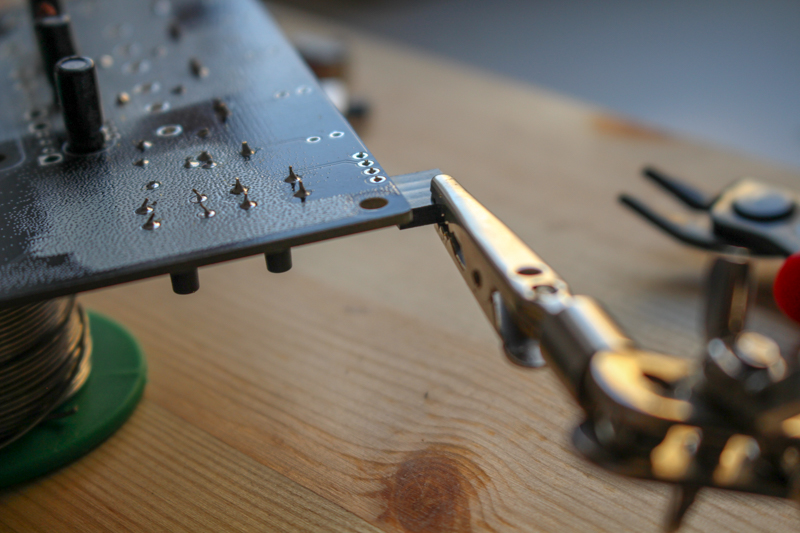

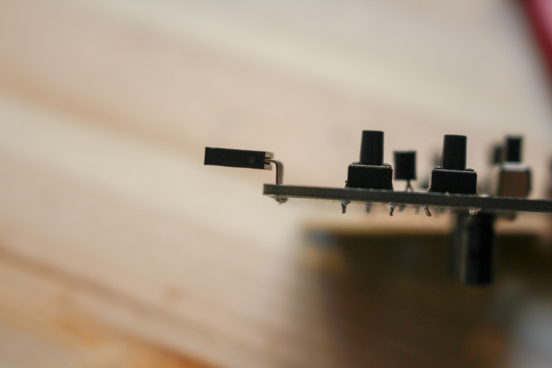

Add (in this order): 5 slide switches, power connector, three 3.5mm mono jacks, three 10k potentiometers. For pots and slide switches it's ok to solder only the three middle pins.

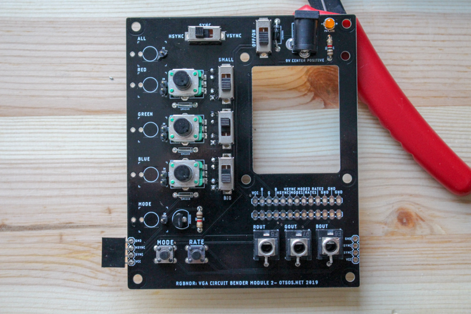

Solder wires from the test gen board to the RGBNDR board.

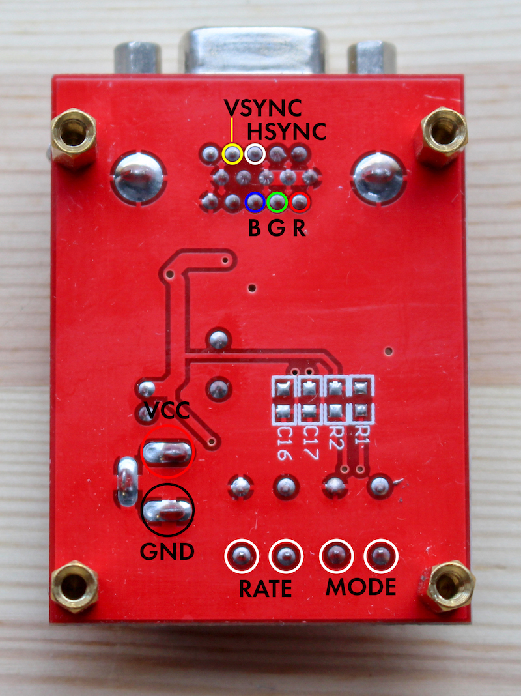

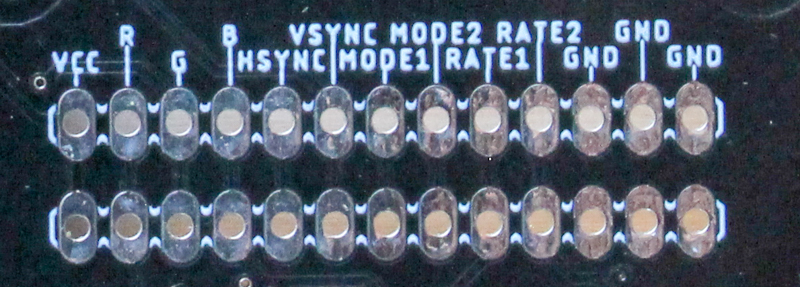

Done!

## Building modulator board

Here's what you'll need:

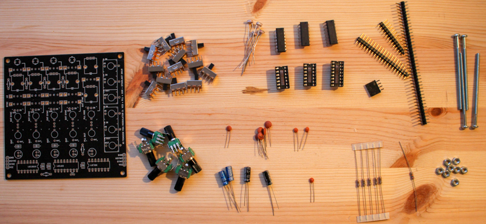

| Num | Part | Val | Comment | Link |
|-----|------|-----|---------|------|
|11x1|Male pin header||||			
|5x2|Male pin header||||			
|1x4|Male pin header|90° angle|||
|4|LDR||Optional||
|13|Slide switch|SLIDE SWITCH 1P2T THROUGH HOLE 0.5A 50VDC|If you don't use LDRs, replace switch with jumper|https://www.taydaelectronics.com/slide-switch-1p2t-through-hole-0-5a-50vdc-2713.html|
|1|Ceramic capacitor|22pF||||
|1|Ceramic capacitor|0.001uF (102)|||
|2|Ceramic capacitor|0.01uF (103)|||
|5|Ceramic capacitor|0.1uF (104)|||
|2|Electrolytic capacitor|100uF|Remember polarity!||
|1|Electrolytic capacitor|10uF|Remember polarity!||
|1|Electrolytic capacitor|1uF|Remember polarity!||
|6|Potentiometer|100k|||
|1|Resistor|20k|||
|5|Resistor|100R|||
|1|IC|40106|||
|1|IC|4046|||
|1|IC|4070|||

Start with the flattest parts so that soldering is as easy as possible. So:

1. Resistors
2. ICs
3. Header pins
4. Caps
5. Switches
6. LDRs
7. Pots

Few tips:

Use IC sockets and align them correctly. I made a mistake on the photo:

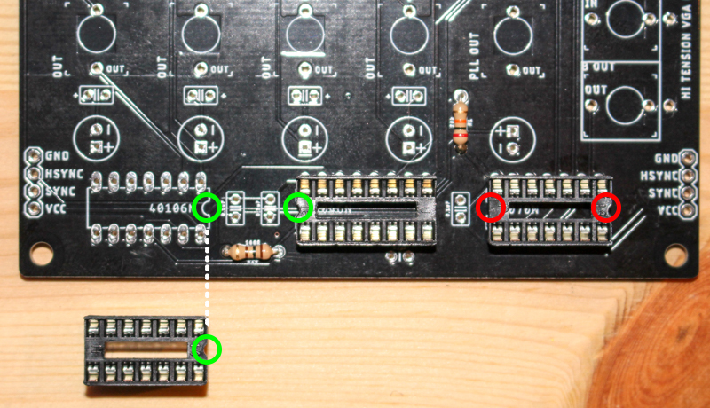

You can chose what ever values for oscillator caps you want. Together with a potentiometer these will define frequency for an oscillator. For each oscillator you can pick big and small cap and change between those with a switch.

My setup is like this but try your own values!

|     |OSC 1|OSC 2|OSC 3|OSC 4|4046 MOD|
|-----|-----|-----|-----|-----|--------|
|SMALL|10nF|0.1nF|0.01nF|0.001nf| - |
| BIG |100nF|1nF|0.1nF|0.01nF|100nF|

I put the big caps on the bottom side.

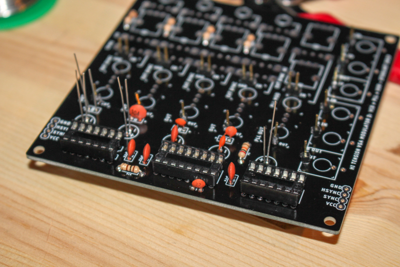

After some soldering it should look more or less like this:

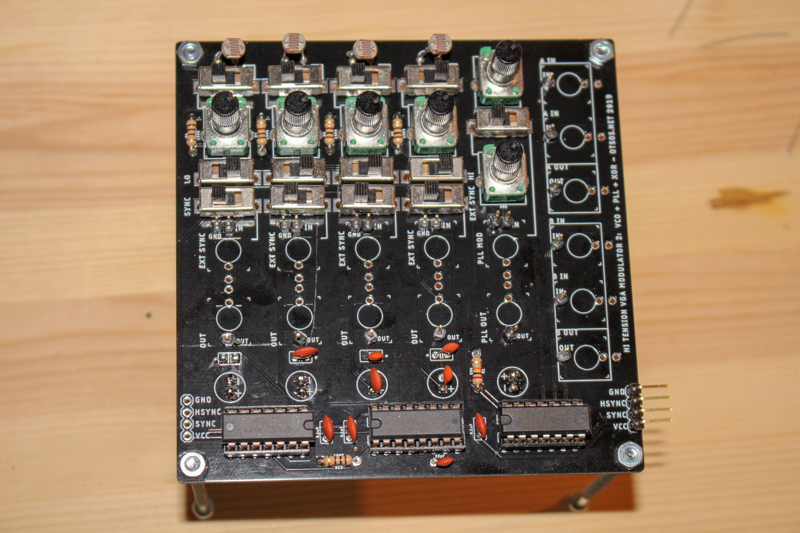

Hook it up with RGBNDR and that's it!

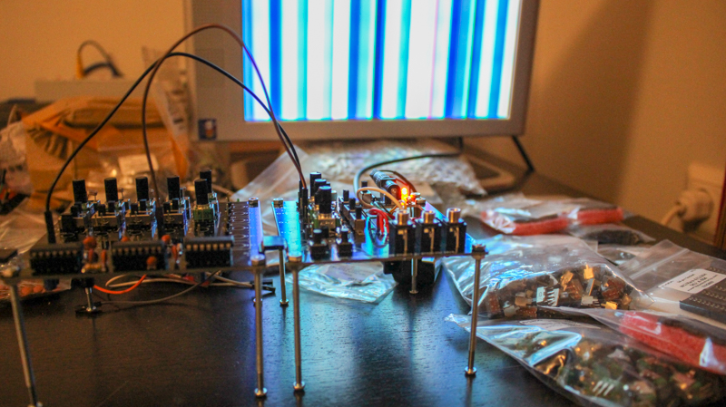

Later you can make a box for it. Here's an older version with jacks:

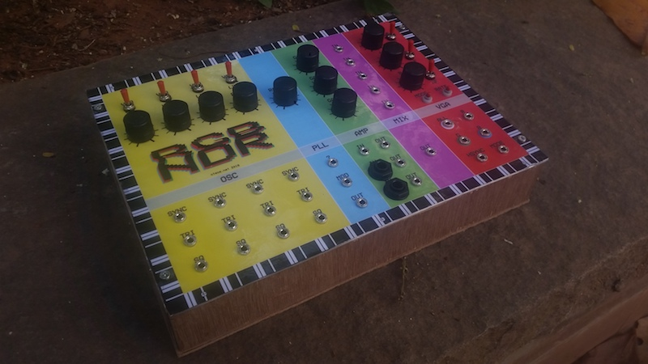
