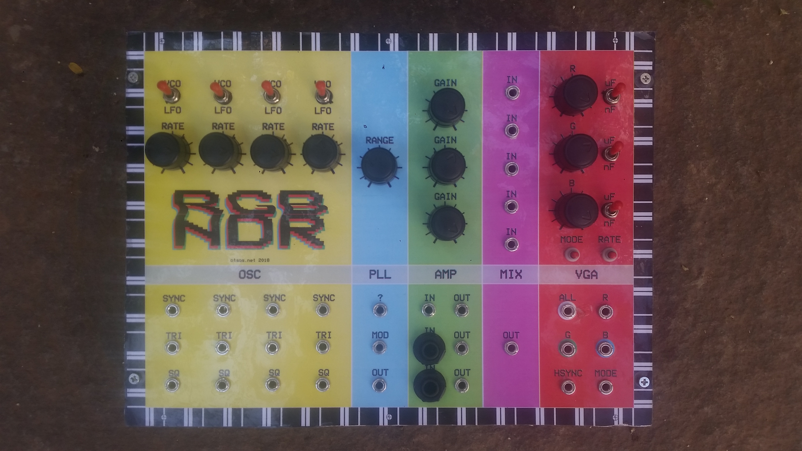
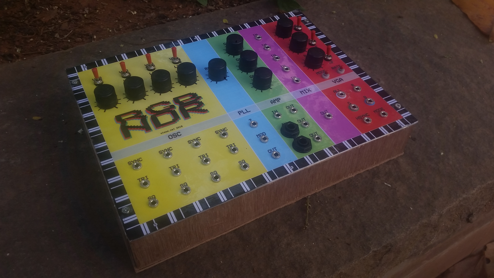

#RGBNDR

RGBNDR is a video synthesiser made by circuit bending a VGA test generator. Inspired by [CHA/V by Jonas Bers](https://jonasbers.com/chav/).

Amps and mixer still need a bit of work, otherwise working quite nicely!

## Circuit bending the VGA test gen

